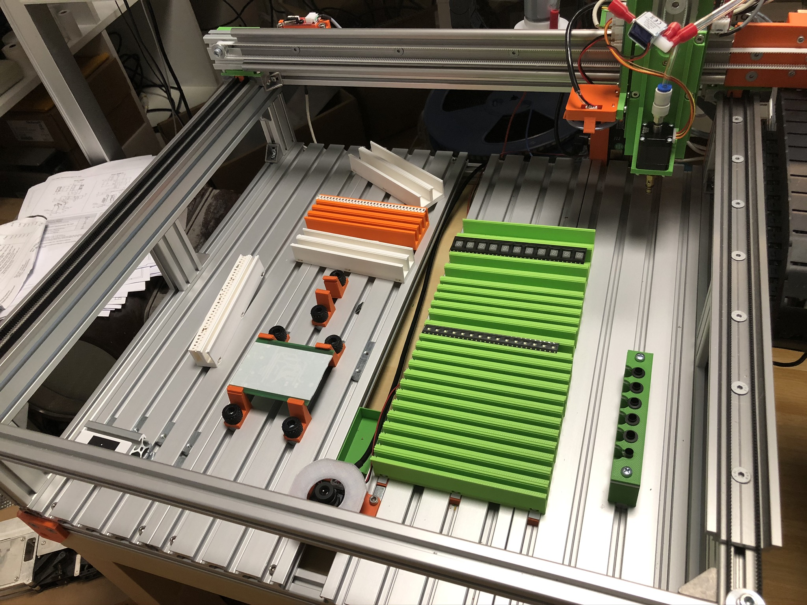

## My OpenPnP pick and place machine stuff

This is a place where a publish all my work building a pick and place machine including mechanics, electronics, Marlin firmware modifications and 3D printed designs.

The machine is driven by the excellent and open sourced [OpenPNP software](http://openpnp.org).

### Things to do

This is still a work-in-progress project, so not everything is either published or at final stage. Currently following tasks are ongoing:

#### Z-axis rework

Currently the Z-axis uses Igus slider which are showing high tolerances when pushed/pulled in Y direction. The rails will be therefore replaced with dual MGN9 rails with 2 carriages each for better stability/accuracy.

### Updates

- 23,08.2020 : Added Y axis OpenSCAD design files
- 15.08.2020 : Updated Tool Changer design
- 14.08.2020 : Added OpenSCAD Camera Mounts
- 14.08.2020 : Added OpenSCAD CP40 Nozzle Holder
