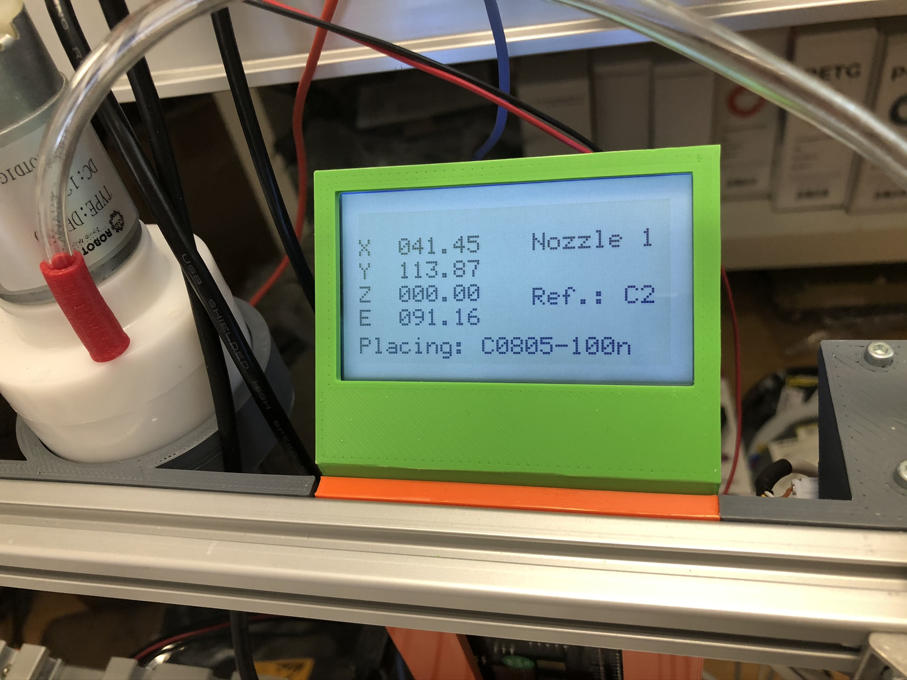

## Marlin modifications for using with OpenPNP

Normally Marlin firmware is meant for running a 3d printer, though it has some configuration options to be used for CNC milling and laser cutters.

The most obvious changes are:

- Add dual stepper for Y-axis
- Home position of Z-axis at Z-Max. The Z-axis moves down starting at 0.
- Change XYZ homing bump speed
- Configure outputs to be used for vacuum pump, vacuum valve and LED lighting

The not so easy modifications are for the LCD status screen where we just want to display all coordinates together with what the machine is doing. All 3d printer related icons are removed.

- Remove 3d printer icons
- Layout all coordinates vertically with XXX.XX precision
- Modify the M117 status message Gcode command to add more messages on the screen

