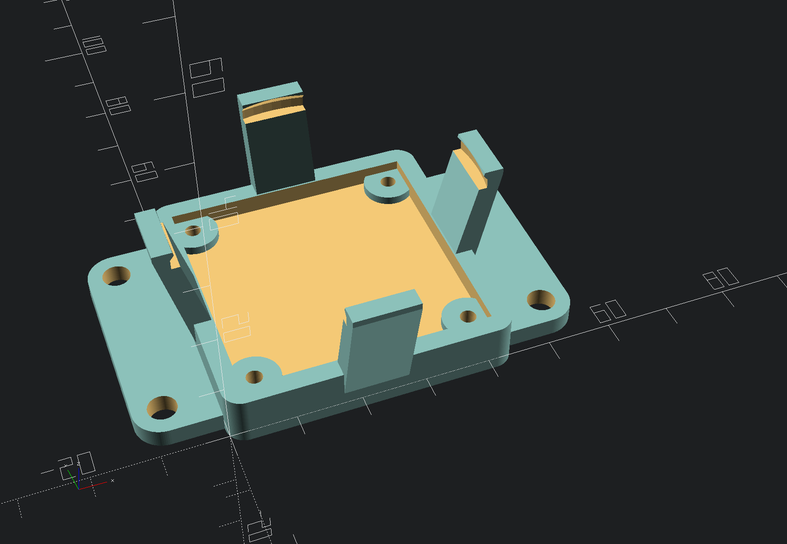
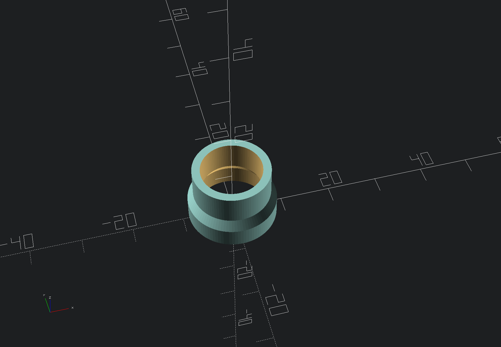
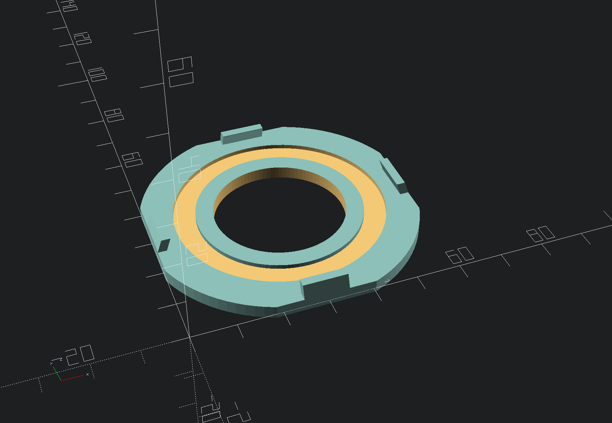

## Camera mounts

This directory contains OpenSCAD design files for my camera mounts and a LED diffuser.

### Bottom mount

This is for a square PCB USB camera you can find on Ebay.

### Top mount

This is for the same sized USB camera as the one mounted at the bottom.

### Lens adapter

During experimenting with different lenses it turned out that
the M12 0.5mm thread on those camera are too short to focus close objects.

This adapter just snaps onto the camera's thread end extends the focal distance.

### LED diffuser

This diffuser should be printed with transparent PLA or PETG.
You might want to play with the infill percentage and infill angle.

You can just snap on the camera mounts above.
