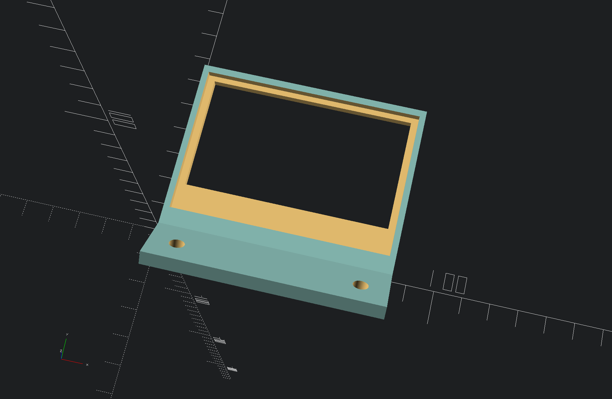
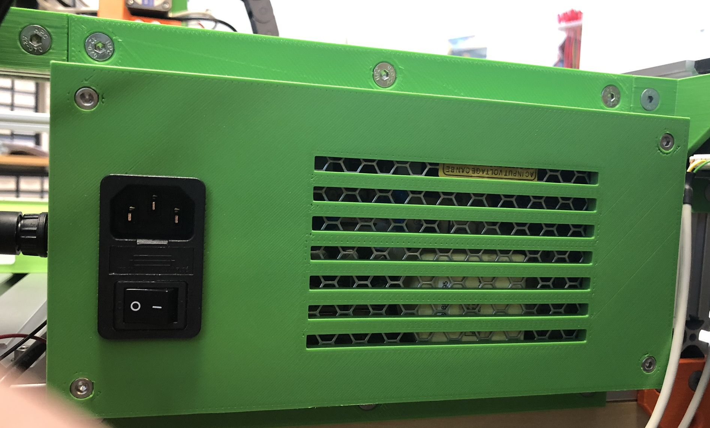
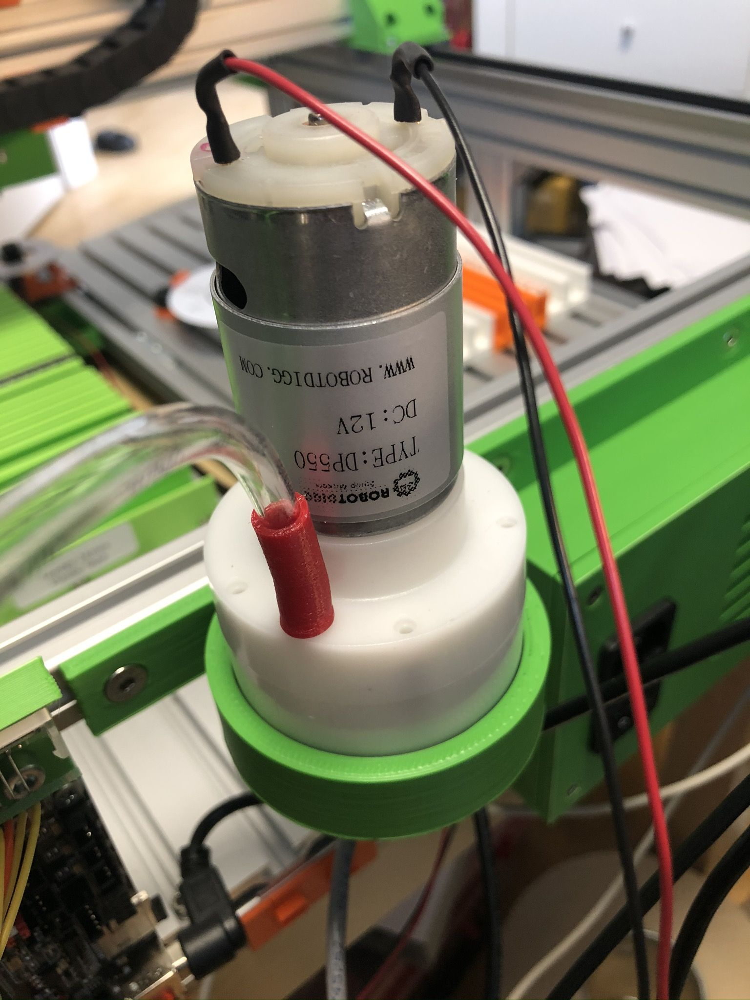

## Electronics

Here are the OpenSCAD design files for attaching various electronic components to the machine.

### PCB mount for BTT SKR v1.4

### LCD mount for Newhaven 12864 LC display

This is a holder for the Newhaven LC display INHD-C12864-1Z-FSW-FB-HTT. It is meant to screw it at the top of the PCB holder as a PCB holder with LCD mount wasn't really printable, so I did a two-part design.

### Power supply mount

### Vacuum pump holder

