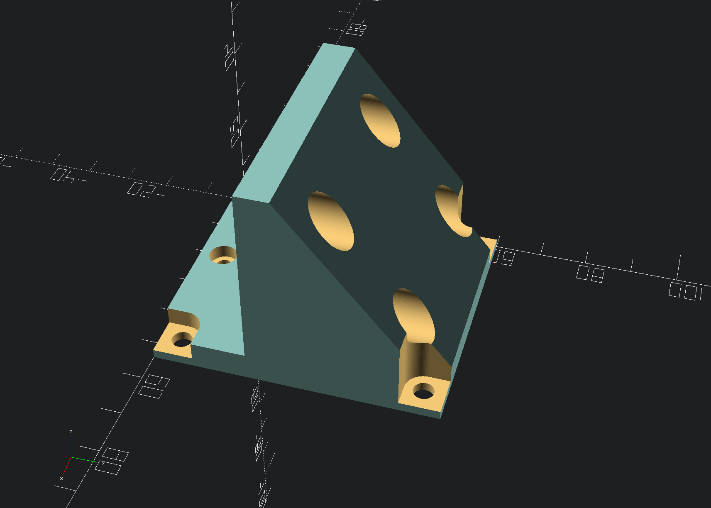

## X axis

Here you find my OpenSCAD design files in regards to the X-axis setup.

Be aware that the resulting STL files might give different results in your 3D printer due to different nozzle width and printer settings.

### X rail mounts

