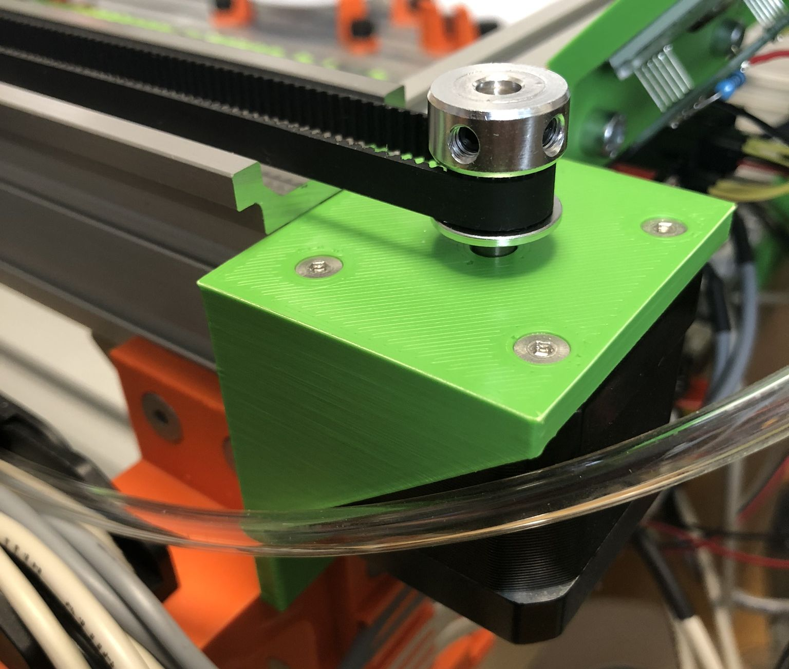
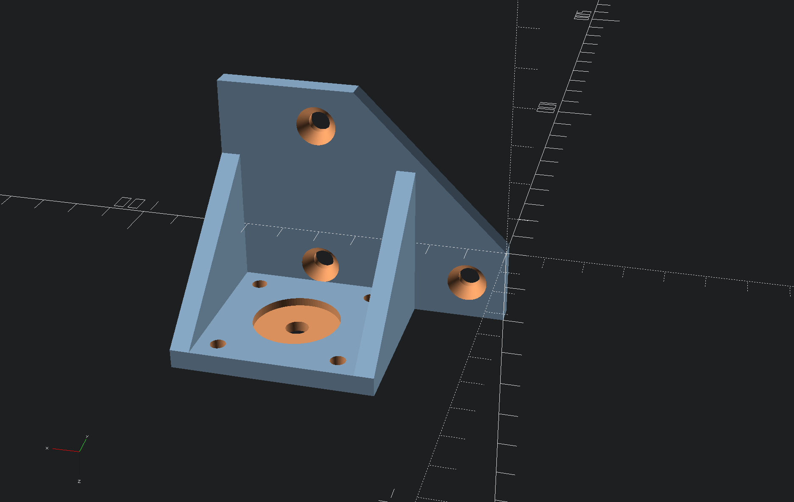

## Y axis

Here you find my OpenSCAD design files in regards to the dual Y-axis setup.

Be aware that the resulting STL files might give different results in your 3D printer due to different nozzle width and printer settings.

### Y motor mount

The Y motor mount takes a Nema 17 motor with a width of 42mm. It is mounted with 3 M5 screws directly at the back of machine on the aluminum frame. There is only one design file, so for printing both sides you have to mirror one mesh in your slicer software.

### Y belt tensioner

The belt tensioner for the y-axis consists of three parts:

    - Tensioner screw
    - Tensioner knob
    - Tensioner mount

For the thread I used this thingiverse OpenSCAD library:

[OpenScad library. Threads for screws and nuts V1](https://www.thingiverse.com/thing:3131126)

For better durability I printed those parts (as most parts of my machine) with ASA filament. It is advisable to print the screw and the knob with a layer height not greater than 0.2mm. Also for both sides for the tensioner mount you have to mirror one mesh in your slicer.
