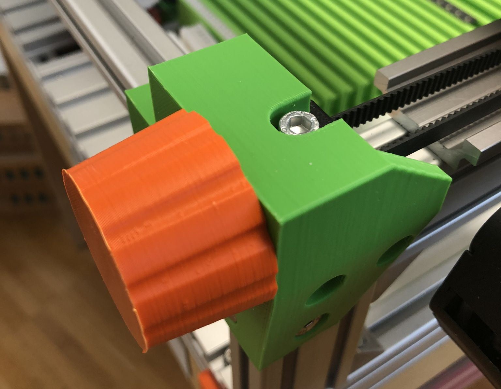
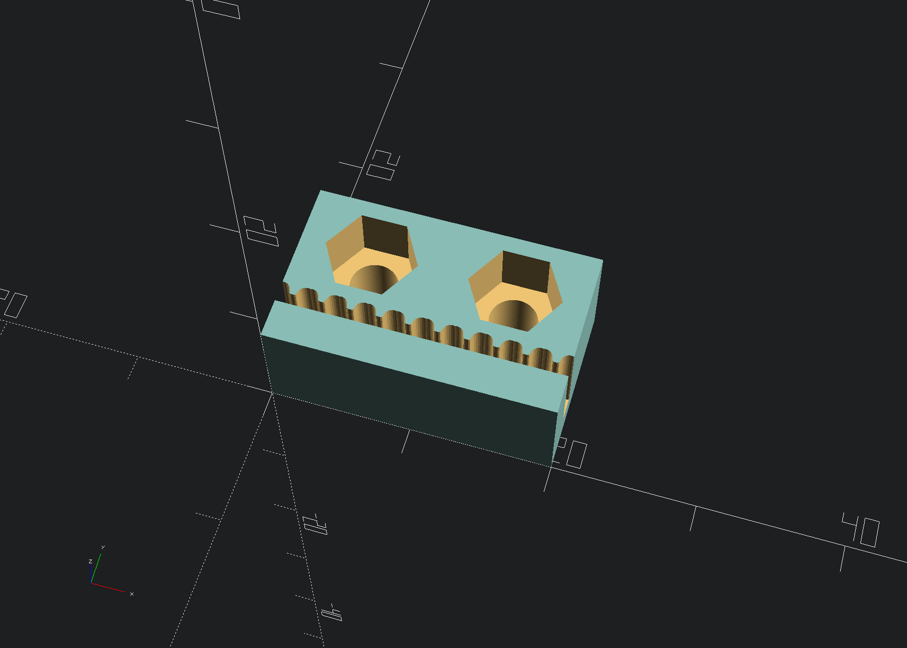

## Y axis

Here you find my OpenSCAD design files in regards to the dual Y-axis setup.

Be aware that the resulting STL files might give different results in your 3D printer due to different nozzle width and printer settings.

### Y motor mount

The Y motor mount takes a Nema 17 motor with a width of 42mm mounted with 4 M3x8 counter sunk head screws. It is mounted with 3 M5x10 counter sunk head screws directly at the back of machine on the aluminum frame. There is only one design file, so for printing both sides you have to mirror one mesh in your slicer software.

### Y belt tensioner

The belt tensioner for the y-axis consists of three parts:

    - Tensioner screw
    - Tensioner knob
    - Tensioner mount

For the thread I used this thingiverse OpenSCAD library:

[OpenScad library. Threads for screws and nuts V1](https://www.thingiverse.com/thing:3131126)

For better durability I printed those parts (as most parts of my machine) with ASA filament. It is advisable to print the screw and the knob with a layer height not greater than 0.2mm. Also for both sides for the tensioner mount you have to mirror one mesh in your slicer.

### X rail mounts

The X rail mounts are designed to be screwed directly onto Igus slider blocks. Also they hold at the bottom the GT2 belt clamp mechanism. Igus rails were chosen for the Y-axis as a 6mm wide GT2 belt fits perfectly between rails and slider block.

### GT2 clamp

This is a preliminary design as I think that it might be the cause for some backslash in the Y-axis.

The GT2 clamp which mounts directly under the X-rail mounts uses a GT2 timing belt OpenSCAD module used for cutting out the profile. Depending on the thickness of the belt you might want to adjust this section:

    translate([-2, 3.35, 6]) belt_len(profile = tGT2_2, belt_width = 8, len = 100);
    translate([-2.2, 3.5, 6]) belt_len(profile = tGT2_2, belt_width = 8, len = 100);
    translate([-1.9, 3.5, 6]) belt_len(profile = tGT2_2, belt_width = 8, len = 100);

It just cuts out the GT2 slot at slightly different location to accommodate for thicker belts. You might want to do some test prints and check with your GT2 belt if it fits perfectly and doesn't causes any backslash.
