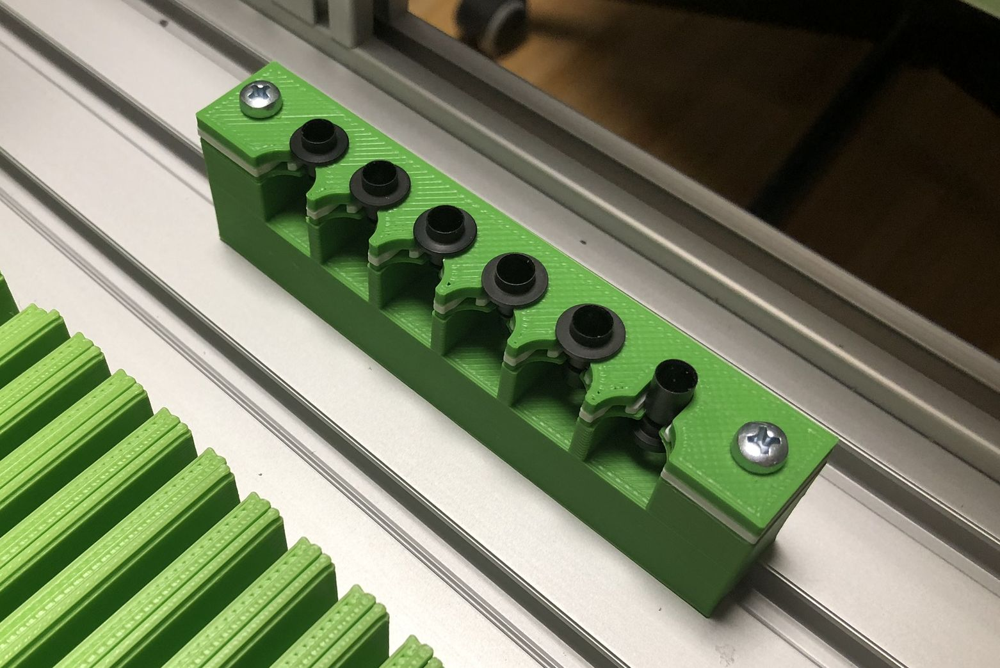
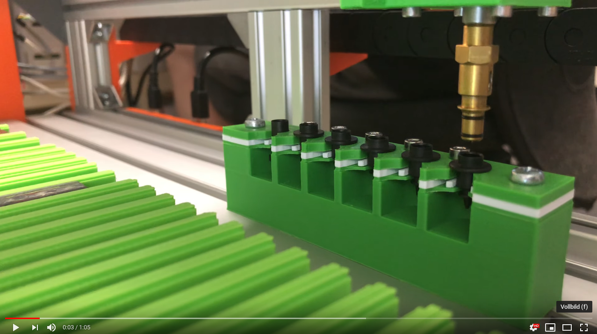
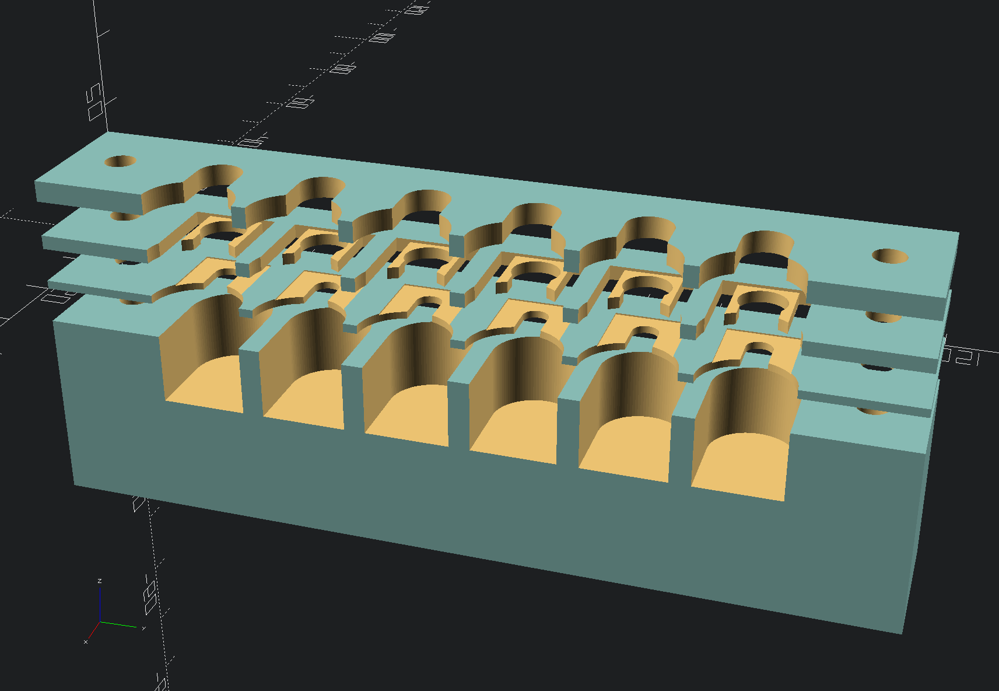

## Tool Changer for CP40 nozzles

This is a simple design for CP40 nozzle holder.
The number and the distance betwwen nozzles is configurable in OpenSCAD.

This design uses 4 parts for this:

- Tool_Changer_Mount.scad: Bottom part for mounting all 4 parts to the table. Height has to be adjusted to your needs.
- Tool_Changer_Bottom,scad: A thin layer of 1mm where the nozzles slide in, the thickness is adjusted with the 's' parameter
- Tool_Changer_Middle.scad: This part uses a clamp mechanism so that nozzles stay in place. The force of the clamp can be adjusted with the 'o' parameter'
- Tool_Changer_Top.scad: Top layer which will be screwed down to the table with all other parts

Here is a YouTube video showing how it works:

### 3D Printing

I have printed all parts excep the middler layer which clamps the nozzles with ASA material for its strength.
The clamp itself was printed in PETG as with ASA it starts to bend during printing when you don't use or have a chamber like me (o;

### Assembly

To mount the tool changer on the machine's table I used M4 x 45 screws....
For clamping all layers together you would (Number of nozzles - 1) M3 x 16 screws and a M3 nut which slides in the bottom mount block at the back.
